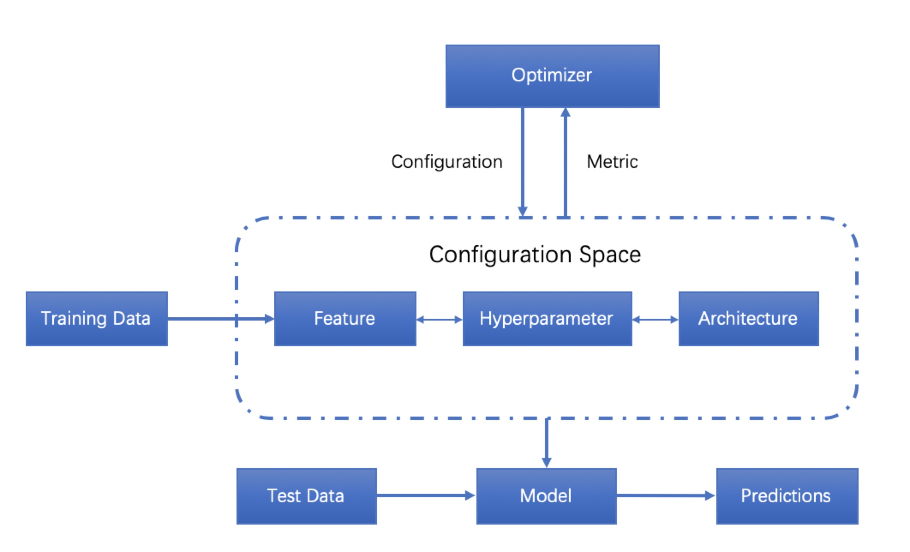
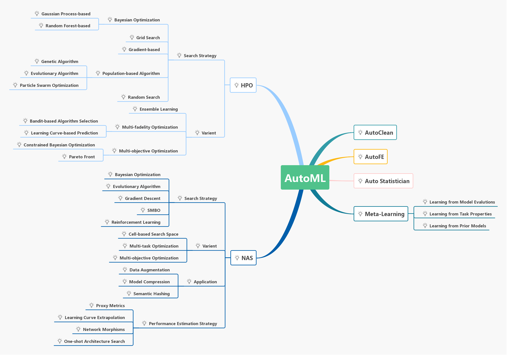

# Awesome-AutoML-Papers

**Awesome-AutoML-Papers** is a curated list of *automated machine learning* papers, articles, tutorials, slides and projects. **Star** this repository, and then you can keep abreast of the latest developments of this booming research field. Thanks to all the people who made contributions to this project. Join us and you are welcome to be a contributor.

# What is AutoML?
*Automated Machine Learning* (AutoML) provides methods and processes to make Machine Learning available for non-Machine Learning experts, to improve efficiency of Machine Learning and to accelerate research on Machine Learning.

Machine Learning (ML) has achieved considerable successes in recent years and an ever-growing number of disciplines rely on it. However, this success crucially relies on human machine learning experts to perform the following tasks:
+ Preprocess the data,
+ Select appropriate features,
+ Select an appropriate model family,
+ Optimize model hyperparameters,
+ Postprocess machine learning models,
+ Critically analyze the results obtained.

As the complexity of these tasks is often beyond non-ML-experts, the rapid growth of machine learning applications has created a demand for off-the-shelf machine learning methods that can be used easily and without expert knowledge. We call the resulting research area that targets progressive automation of machine learning *AutoML*. As a new sub-area in machine learning, *AutoML* has got more attention not only in machine learning but also in computer vision, natural language processing and graph computing.

There are no formal definition of *AutoML*. From the descriptions of most papers，the basic procedure of *AutoML* can be shown as the following.

*AutoML* approaches are already mature enough to rival and sometimes even outperform human machine learning experts. Put simply, *AutoML* can lead to improved performance while saving substantial amounts of time and money, as machine learning experts are both hard to find and expensive. As a result, commercial interest in *AutoML* has grown dramatically in recent years, and several major tech companies and start-up companies are now developing their own *AutoML* systems. An overview comparison of some of them can be summarized to the following table.

| Company       | AutoFE     | HPO        | NAS        |
| :-----------: | :--------: | :--------: | :--------: |
| 4paradigm     |     √      |      √     |      ×     |
| Alibaba       |     ×      |      √     |      ×     |
| Baidu         |     ×      |      ×     |      √     |
| Determined AI |     ×      |      √     |      √     |
| Google        |     √      |      √     |      √     |
| DataCanvas    |     √      |      √     |      √     |
| H2O.ai        |     √      |      √     |      ×     |
| Microsoft     |     ×      |      √     |      √     |
| MLJAR         |     √      |      √     |      √     |
| RapidMiner    |     √      |      √     |      ×     |
| Tencent       |     ×      |      √     |      ×     |

**Awesome-AutoML-Papers** includes very up-to-date overviews of the bread-and-butter techniques we need in *AutoML*:
+ Automated Data Clean (Auto Clean)
+ Automated Feature Engineering (Auto FE)
+ Hyperparameter Optimization (HPO)
+ Meta-Learning
+ Neural Architecture Search (NAS)

# Table of Contents
+ [Papers](#papers)
  - [Surveys](#surveys)
  - [Automated Feature Engineering](#automated-feature-engineering)
    - [Expand Reduce](#expand-reduce)
    - [Hierarchical Organization of Transformations](#hierarchical-organization-of-transformations)
    - [Meta Learning](#meta-learning)
    - [Reinforcement Learning](#reinforcement-learning)
  - [Architecture Search](#architecture-search)
    - [Evolutionary Algorithms](#evolutionary-algorithms)
    - [Local Search](#local-search)
    - [Meta Learning](#meta-learning-1)
    - [Reinforcement Learning](#reinforcement-learning-1)
    - [Transfer Learning](#transfer-learning)
    - [Network Morphism](#network-morphism)
    - [Continuous Optimization](#continuous-optimization)
  - [Hyperparameter Optimization](#hyperparameter-optimization)
    - [Bayesian Optimization](#bayesian-optimization)
    - [Evolutionary Algorithms](#evolutionary-algorithms-1)
    - [Lipschitz Functions](#lipschitz-functions)
    - [Local Search](#local-search-1)
    - [Meta Learning](#meta-learning-2)
    - [Particle Swarm Optimization](#particle-swarm-optimization)
    - [Random Search](#random-search)
    - [Transfer Learning](#transfer-learning-1)
  - [Performance Prediction](#performance-prediction)
    - [Performance Prediction](##)
  - [Frameworks](#frameworks)
  - [Miscellaneous](#miscellaneous)
+ [Tutorials](#tutorials)
  - [Bayesian Optimization](#bayesian-optimization)
  - [Meta Learning](#meta-learning-3)
+ [Articles](#articles)
  - [Bayesian Optimization](#bayesian-optimization)
  - [Meta Learning](#meta-learning)
+ [Slides](#slides)
  - [Bayesian Optimization](#slides)
+ [Books](#books)
  - [Meta Learning](#books)
+ [Projects](#projects)
+ [Prominent Researchers](#prominent-researchers)

# Papers
### Surveys
+ 2019 | AutoML: A Survey of the State-of-the-Art | Xin He, et al. | arXiv | [`PDF`](https://arxiv.org/pdf/1908.00709.pdf)
+ 2019 | Survey on Automated Machine Learning | Marc Zoeller, Marco F. Huber | arXiv | [`PDF`](https://arxiv.org/pdf/1904.12054.pdf)
+ 2019 | Automated Machine Learning: State-of-The-Art and Open Challenges | Radwa Elshawi, et al. | arXiv | [`PDF`](https://arxiv.org/pdf/1906.02287.pdf)
+ 2018 | Taking Human out of Learning Applications: A Survey on Automated Machine Learning | Quanming Yao, et al. | arXiv | [`PDF`](https://arxiv.org/pdf/1810.13306.pdf)
+ 2020 | On Hyperparameter Optimization of Machine Learning Algorithms: Theory and Practice | Li Yang, et al. | Neurocomputing | [`PDF`](https://arxiv.org/pdf/2007.15745.pdf)
+ 2020 | Automated Machine Learning--a brief review at the end of the early years | Escalante, H. J. | arXiv | [`PDF`](https://arxiv.org/pdf/2008.08516.pdf)
+ 2022 | IoT Data Analytics in Dynamic Environments: From An Automated Machine Learning Perspective | Li Yang, et al. | arXiv | [`PDF`](https://arxiv.org/pdf/2209.08018.pdf)
### Automated Feature Engineering
+ #### Expand Reduce
 - 2022 | BERT-Sort: A Zero-shot MLM Semantic Encoder on Ordinal Features for AutoML | Mehdi Bahrami, et al. | AutoML | [`PDF`](https://github.com/marscod/BERT-Sort)
  - 2017 | AutoLearn — Automated Feature Generation and Selection | Ambika Kaul, et al. | ICDM | [`PDF`](https://ieeexplore.ieee.org/document/8215494/)
  - 2017 | One button machine for automating feature engineering in relational databases | Hoang Thanh Lam, et al. | arXiv | [`PDF`](https://arxiv.org/pdf/1706.00327.pdf)
  - 2016 | Automating Feature Engineering | Udayan Khurana, et al. | NIPS | [`PDF`](http://workshops.inf.ed.ac.uk/nips2016-ai4datasci/papers/NIPS2016-AI4DataSci_paper_13.pdf)
  - 2016 | ExploreKit: Automatic Feature Generation and Selection | Gilad Katz, et al. | ICDM | [`PDF`](http://ieeexplore.ieee.org/document/7837936/)
  - 2015 | Deep Feature Synthesis: Towards Automating Data Science Endeavors | James Max Kanter, Kalyan Veeramachaneni | DSAA | [`PDF`](http://www.jmaxkanter.com/static/papers/DSAA_DSM_2015.pdf)
+ #### Hierarchical Organization of Transformations
  - 2016 | Cognito: Automated Feature Engineering for Supervised Learning | Udayan Khurana, et al. | ICDMW | [`PDF`](http://ieeexplore.ieee.org/document/7836821/)
+ #### Meta Learning
  - 2020 | AutoML Pipeline Selection: Efficiently Navigating the Combinatorial Space | Chengrun Yang, et al. | KDD | [`PDF`](https://people.ece.cornell.edu/cy/_papers/tensor_oboe.pdf)
  - 2017 | Learning Feature Engineering for Classification | Fatemeh Nargesian, et al. | IJCAI | [`PDF`](https://www.ijcai.org/proceedings/2017/0352.pdf)
+ #### Reinforcement Learning
  - 2017 | Feature Engineering for Predictive Modeling using Reinforcement Learning | Udayan Khurana, et al. | arXiv | [`PDF`](https://arxiv.org/pdf/1709.07150.pdf)
  - 2010 | Feature Selection as a One-Player Game | Romaric Gaudel, Michele Sebag | ICML | [`PDF`](https://hal.archives-ouvertes.fr/inria-00484049/document)
### Architecture Search
+ #### Evolutionary Algorithms
  - 2019 | Evolutionary Neural AutoML for Deep Learning | Jason Liang, et al. | GECCO | [`PDF`](https://dl.acm.org/doi/pdf/10.1145/3321707.3321721)
  - 2017 | Large-Scale Evolution of Image Classifiers | Esteban Real, et al. | PMLR | [`PDF`](https://arxiv.org/abs/1703.01041)
  - 2002 | Evolving Neural Networks through Augmenting Topologies | Kenneth O.Stanley, Risto Miikkulainen | Evolutionary Computation | [`PDF`](http://nn.cs.utexas.edu/downloads/papers/stanley.ec02.pdf)
+ #### Local Search
  - 2017 | Simple and Efficient Architecture Search for Convolutional Neural Networks | Thomoas Elsken, et al. | ICLR | [`PDF`](https://arxiv.org/pdf/1711.04528.pdf)
+ #### Meta Learning
  - 2016 | Learning to Optimize | Ke Li, Jitendra Malik | arXiv | [`PDF`](https://arxiv.org/pdf/1606.01885.pdf)
+ #### Reinforcement Learning
  - 2018 | AMC: AutoML for Model Compression and Acceleration on Mobile Devices | Yihui He, et al. | ECCV | [`PDF`](http://openaccess.thecvf.com/content_ECCV_2018/papers/Yihui_He_AMC_Automated_Model_ECCV_2018_paper.pdf)
  - 2018 | Efficient Neural Architecture Search via Parameter Sharing | Hieu Pham, et al. | arXiv | [`PDF`](https://arxiv.org/abs/1802.03268)
  - 2017 | Neural Architecture Search with Reinforcement Learning | Barret Zoph, Quoc V. Le | ICLR | [`PDF`](https://arxiv.org/pdf/1611.01578.pdf)
+ #### Transfer Learning
  - 2017 | Learning Transferable Architectures for Scalable Image Recognition | Barret Zoph, et al. | arXiv | [`PDF`](https://arxiv.org/abs/1707.07012)
+ #### Network Morphism
  - 2019 | Auto-Keras: An Efficient Neural Architecture Search System | Haifeng Jin, et al. | KDD | [`PDF`](https://dl.acm.org/doi/pdf/10.1145/3292500.3330648)
+ #### Continuous Optimization
  - 2018 | Neural Architecture Optimization | Renqian Luo, et al. | arXiv | [`PDF`](https://arxiv.org/abs/1808.07233)
  - 2019 | DARTS: Differentiable Architecture Search | Hanxiao Liu, et al. | ICLR | [`PDF`](https://arxiv.org/abs/1806.09055)
  - 2021 | SEDONA: Search for Decoupled Neural Networks toward Greedy Block-wise Learning | Pyeon, et al. | ICLR | [`PDF`](https://openreview.net/pdf?id=XLfdzwNKzch)

### Frameworks
+ 2019 | Auptimizer -- an Extensible, Open-Source Framework for Hyperparameter Tuning | Jiayi Liu, et al. | IEEE Big Data | [`PDF`](https://arxiv.org/pdf/1911.02522)
+ 2019 | Towards modular and programmable architecture search | Renato Negrinho, et al. | NeurIPS | [`PDF`](https://arxiv.org/pdf/1909.13404.pdf)
+ 2019 | Evolutionary Neural AutoML for Deep Learning | Jason Liang, et al. | arXiv | [`PDF`](https://arxiv.org/abs/1902.06827)
+ 2017 | ATM: A Distributed, Collaborative, Scalable System for Automated Machine Learning | T. Swearingen, et al. | IEEE | [`PDF`](https://cyphe.rs/static/atm.pdf)
+ 2017 | Google Vizier: A Service for Black-Box Optimization | Daniel Golovin, et al. | KDD |[`PDF`](https://static.googleusercontent.com/media/research.google.com/zh-CN//pubs/archive/46180.pdf)
+ 2015 | AutoCompete: A Framework for Machine Learning Competitions | Abhishek Thakur, et al. | ICML | [`PDF`](https://arxiv.org/pdf/1507.02188.pdf)

### Hyperparameter Optimization
+ #### Bayesian Optimization
  - 2020 | Bayesian Optimization of Risk Measures | NeurIPS | [`PDF`](https://proceedings.neurips.cc/paper/2020/file/e8f2779682fd11fa2067beffc27a9192-Paper.pdf)
  - 2020 | BOTORCH: A Framework for Efficient Monte-Carlo Bayesian Optimization | NeurIPS | [`PDF`](https://proceedings.neurips.cc/paper/2020/file/f5b1b89d98b7286673128a5fb112cb9a-Paper.pdf)
  - 2020 | Tuning Hyperparameters without Grad Students: Scalable and Robust Bayesian Optimisation with Dragonfly | JMLR | [`PDF`](https://arxiv.org/pdf/1903.06694.pdf)
  - 2019 | Bayesian Optimization with Unknown Search Space  | NeurIPS | [`PDF`](http://papers.nips.cc/paper/9350-bayesian-optimization-with-unknown-search-space.pdf)
  - 2019 | Constrained Bayesian optimization with noisy experiments | [`PDF`](https://projecteuclid.org/download/pdfview_1/euclid.ba/1533866666)
  - 2019 | Learning search spaces for Bayesian optimization: Another view of hyperparameter transfer learning | NeurIPS | [`PDF`](http://papers.nips.cc/paper/9438-learning-search-spaces-for-bayesian-optimization-another-view-of-hyperparameter-transfer-learning.pdf)
  - 2019 | Practical Two-Step Lookahead Bayesian Optimization | NeurIPS | [`PDF`](http://papers.nips.cc/paper/9174-practical-two-step-lookahead-bayesian-optimization.pdf)
  - 2019 | Predictive entropy search for multi-objective bayesian optimization with constraints | [`PDF`](https://arxiv.org/pdf/1609.01051.pdf)
  - 2018 | BOCK: Bayesian optimization with cylindrical kernels | ICML | [`PDF`](https://arxiv.org/pdf/1806.01619.pdf)
  - 2018 | Efficient High Dimensional Bayesian Optimization with Additivity and Quadrature Fourier Features | Mojmír Mutný, et al. | NeurIPS | [`PDF`](https://papers.nips.cc/paper/8115-efficient-high-dimensional-bayesian-optimization-with-additivity-and-quadrature-fourier-features.pdf)
  - 2018 | High-Dimensional Bayesian Optimization via Additive Models with Overlapping Groups. |  PMLR | [`PDF`](https://arxiv.org/pdf/1802.07028v2.pdf)
  - 2018 | Maximizing acquisition functions for Bayesian optimization | NeurIPS | [`PDF`](http://papers.nips.cc/paper/8194-maximizing-acquisition-functions-for-bayesian-optimization.pdf)
  - 2018 | Scalable hyperparameter transfer learning | NeurIPS | [`PDF`](http://papers.nips.cc/paper/7917-scalable-hyperparameter-transfer-learning.pdf)
  - 2016 | Bayesian Optimization with Robust Bayesian Neural Networks | Jost Tobias Springenberg， et al. | NIPS | [`PDF`](https://papers.nips.cc/paper/6117-bayesian-optimization-with-robust-bayesian-neural-networks.pdf)
  - 2016 | Scalable Hyperparameter Optimization with Products of Gaussian Process Experts | Nicolas Schilling, et al. | PKDD | [`PDF`](https://link.springer.com/chapter/10.1007/978-3-319-46128-1_3)
  - 2016 | Taking the Human Out of the Loop: A Review of Bayesian Optimization | Bobak Shahriari, et al. | IEEE | [`PDF`](http://ieeexplore.ieee.org/document/7352306/)
  - 2016 | Towards Automatically-Tuned Neural Networks | Hector Mendoza, et al. | JMLR | [`PDF`](http://aad.informatik.uni-freiburg.de/papers/16-AUTOML-AutoNet.pdf)
  - 2016 | Two-Stage Transfer Surrogate Model for Automatic Hyperparameter Optimization | Martin Wistuba, et al. | PKDD | [`PDF`](https://link.springer.com/chapter/10.1007/978-3-319-46128-1_13)
  - 2015 | Efficient and Robust Automated Machine Learning | [`PDF`](https://papers.nips.cc/paper/5872-efficient-and-robust-automated-machine-learning.pdf)
  - 2015 | Hyperparameter Optimization with Factorized Multilayer Perceptrons | Nicolas Schilling, et al. | PKDD | [`PDF`](https://link.springer.com/chapter/10.1007/978-3-319-23525-7_6)
  - 2015 | Hyperparameter Search Space Pruning - A New Component for Sequential Model-Based Hyperparameter Optimization | Martin Wistua, et al. | [`PDF`](https://dl.acm.org/citation.cfm?id=2991491)
  - 2015 | Joint Model Choice and Hyperparameter Optimization with Factorized Multilayer Perceptrons | Nicolas Schilling, et al. | ICTAI | [`PDF`](http://ieeexplore.ieee.org/abstract/document/7372120/)
  - 2015 | Learning Hyperparameter Optimization Initializations | Martin Wistuba, et al. | DSAA | [`PDF`](http://ieeexplore.ieee.org/abstract/document/7344817/)
  - 2015 | Scalable Bayesian optimization using deep neural networks | Jasper Snoek, et al. | ACM | [`PDF`](https://dl.acm.org/citation.cfm?id=3045349)
  - 2015 | Sequential Model-free Hyperparameter Tuning | Martin Wistuba, et al. | ICDM | [`PDF`](http://ieeexplore.ieee.org/abstract/document/7373431/)
  - 2013 | Auto-WEKA: Combined Selection and Hyperparameter Optimization of Classification Algorithms | [`PDF`](http://www.cs.ubc.ca/labs/beta/Projects/autoweka/papers/autoweka.pdf)
  - 2013 | Making a Science of Model Search: Hyperparameter Optimization in Hundreds of Dimensions for Vision Architectures | J. Bergstra | JMLR | [`PDF`](http://proceedings.mlr.press/v28/bergstra13.pdf)
  - 2012 | Practical Bayesian Optimization of Machine Learning Algorithms | [`PDF`](https://papers.nips.cc/paper/4522-practical-bayesian-optimization-of-machine-learning-algorithms.pdf)
  - 2011 | Sequential Model-Based Optimization for General Algorithm Configuration(extended version) | [`PDF`](https://www.cs.ubc.ca/~hutter/papers/10-TR-SMAC.pdf)
+ #### Evolutionary Algorithms
  - 2020 | Delta-STN: Efficient Bilevel Optimization for Neural Networks using Structured Response Jacobians | Juhan Bae, Roger Grosse | Neurips | [`PDF`](https://arxiv.org/abs/2010.13514)
  - 2018 | Autostacker: A Compositional Evolutionary Learning System | Boyuan Chen, et al. | arXiv | [`PDF`](https://arxiv.org/pdf/1803.00684.pdf)
  - 2017 | Large-Scale Evolution of Image Classifiers | Esteban Real, et al. | PMLR | [`PDF`](https://arxiv.org/pdf/1703.01041.pdf)
  - 2016 | Automating biomedical data science through tree-based pipeline optimization | Randal S. Olson, et al. | ECAL | [`PDF`](https://arxiv.org/pdf/1601.07925.pdf)
  - 2016 | Evaluation of a tree-based pipeline optimization tool for automating data science | Randal S. Olson, et al. | GECCO | [`PDF`](https://dl.acm.org/citation.cfm?id=2908918)
+ ####  Lipschitz Functions
  - 2017 | Global Optimization of Lipschitz functions | C´edric Malherbe, Nicolas Vayatis | arXiv | [`PDF`](https://arxiv.org/pdf/1703.02628.pdf)
+ #### Local Search
  - 2009 | ParamILS: An Automatic Algorithm Configuration Framework | Frank Hutter, et al. | JAIR | [`PDF`](https://arxiv.org/pdf/1401.3492.pdf)
+ #### Meta Learning
  - 2019 | OBOE: Collaborative Filtering for AutoML Model Selection | Chengrun Yang, et al. | KDD | [`PDF`](https://dl.acm.org/doi/pdf/10.1145/3292500.3330909) 
  - 2019 | SMARTML: A Meta Learning-Based Framework for Automated Selection and Hyperparameter Tuning for Machine Learning Algorithms | [`PDF`](http://openproceedings.org/2019/conf/edbt/EDBT19_paper_235.pdf)
  - 2008 | Cross-Disciplinary Perspectives on Meta-Learning for Algorithm Selection | [`PDF`](https://dl.acm.org/citation.cfm?id=1456656)
+ #### Particle Swarm Optimization
  - 2017 | Particle Swarm Optimization for Hyper-parameter Selection in Deep Neural Networks | Pablo Ribalta Lorenzo, et al. | GECCO | [`PDF`](https://dl.acm.org/citation.cfm?id=3071208)
  - 2008 | Particle Swarm Optimization for Parameter Determination and Feature Selection of Support Vector Machines | Shih-Wei Lin, et al. | Expert Systems with Applications | [`PDF`](http://www.sciencedirect.com/science/article/pii/S0957417407003752)
+ #### Random Search
  - 2016 | Hyperband: A Novel Bandit-Based Approach to Hyperparameter Optimization | Lisha Li, et al. | arXiv |  [`PDF`](https://arxiv.org/pdf/1603.06560.pdf)
  - 2012 | Random Search for Hyper-Parameter Optimization | James Bergstra, Yoshua Bengio | JMLR | [`PDF`](http://www.jmlr.org/papers/volume13/bergstra12a/bergstra12a.pdf)
  - 2011 | Algorithms for Hyper-parameter Optimization | James Bergstra, et al. | NIPS | [`PDF`](https://dl.acm.org/citation.cfm?id=2986743)
+ #### Transfer Learning
  - 2016 | Efficient Transfer Learning Method for Automatic Hyperparameter Tuning | Dani Yogatama, Gideon Mann | JMLR | [`PDF`](https://pdfs.semanticscholar.org/75f2/6734972ebaffc6b43d45abd3048ef75f15a5.pdf)
  - 2016 | Flexible Transfer Learning Framework for Bayesian Optimisation | Tinu Theckel Joy, et al. | PAKDD | [`PDF`](https://link.springer.com/chapter/10.1007/978-3-319-31753-3_9)
  - 2016 | Hyperparameter Optimization Machines | Martin Wistuba, et al. | DSAA | [`PDF`](http://ieeexplore.ieee.org/abstract/document/7796889/)
  - 2013 | Collaborative Hyperparameter Tuning | R´emi Bardenet, et al. | ICML | [`PDF`](http://proceedings.mlr.press/v28/bardenet13.pdf)

### Miscellaneous
- 2020 | Automated Machine Learning Techniques for Data Streams | Alexandru-Ionut Imbrea | [`PDF`](https://github.com/AlexImb/automl-streams-research-paper/raw/master/A_Imbrea_AutoML_Data_Streams.pdf)
- 2018 | Accelerating Neural Architecture Search using Performance Prediction | Bowen Baker, et al. | ICLR | [`PDF`](https://openreview.net/pdf?id=BJypUGZ0Z)
- 2017 | Automatic Frankensteining: Creating Complex Ensembles Autonomously | Martin Wistuba, et al. | SIAM | [`PDF`](http://epubs.siam.org/doi/pdf/10.1137/1.9781611974973.83)
- 2018 | Characterizing classification datasets: A study of meta-features for meta-learning | Rivolli, Adriano, et al. | arXiv | [`PDF`](https://arxiv.org/pdf/1808.10406.pdf)
- 2020 | Putting the Human Back in the AutoML Loop | Xanthopoulos, Iordanis, et al. | EDBT/ICDT | [`PDF`](http://ceur-ws.org/Vol-2578/ETMLP5.pdf)

# Tutorials
### Bayesian Optimization
+ 2018 | A Tutorial on Bayesian Optimization. | [`PDF`](https://arxiv.org/pdf/1807.02811.pdf)
+ 2010 | A Tutorial on Bayesian Optimization of Expensive Cost Functions, with Application to Active User Modeling and Hierarchical Reinforcement Learning | [`PDF`](https://arxiv.org/pdf/1012.2599v1.pdf)
### Meta Learning
+ 2008 | Metalearning - A Tutorial | [`PDF`](https://pdfs.semanticscholar.org/5794/1a4891f673cadf06fba02419372aad85c3bb.pdf)

# Blog
| Type       | Blog Title | Link       |
| :--------: | :--------: | :--------: |
| HPO        | Bayesian Optimization for Hyperparameter Tuning | [`Link`](https://arimo.com/data-science/2016/bayesian-optimization-hyperparameter-tuning/) |
| Meta-Learning | Learning to learn | [`Link`](http://bair.berkeley.edu/blog/2017/07/18/learning-to-learn/) |
| Meta-Learning | Why Meta-learning is Crucial for Further Advances of Artificial Intelligence? | [`Link`](https://chatbotslife.com/why-meta-learning-is-crucial-for-further-advances-of-artificial-intelligence-c2df55959adf) |

# Books
| Year of Publication     | Type    | Book Title | Authors    | Publisher  | Link       |
| :--------: | :--------: | :--------: | :--------: | :--------: | :--------: |
| 2009       | Meta-Learning | Metalearning - Applications to Data Mining | Brazdil, P., Giraud Carrier, C., Soares, C., Vilalta, R. | Springer | [`Download`](http://www.springer.com/la/book/9783540732624) |
| 2019       | HPO, Meta-Learning, NAS | AutoML: Methods, Systems, Challenges | Frank Hutter, Lars Kotthoff, Joaquin Vanschoren |         | [`Download`](https://www.automl.org/book/) |
| 2021       | Learning | Automated Machine Learning in Action | Qinquan Song, Haifeng Jin, Xia Hu | Manning Publications        | [`Download`](https://www.manning.com/books/automated-machine-learning-in-action) |

# Videos
| Title    | Author    | Link     |
| AutoML Basics: Automated Machine Learning in Action | Qinquan Song, Haifeng Jin, Xia Hu | (https://www.youtube.com/watch?v=9KpieG0B7VM) |

# Projects
| Project    | Type       | Language   | License    | Link       |
| :--------: | :--------: | :--------: | :--------: | :--------: |
| AdaNet     | NAS        | Python     | Apache-2.0 | [`Github`](https://github.com/tensorflow/adanet) |
| Advisor    | HPO        | Python     | Apache-2.0 | [`Github`](https://github.com/tobegit3hub/advisor) |
| AMLA       | HPO, NAS   | Python     | Apache-2.0 | [`Github`](https://github.com/CiscoAI/amla) |
| ATM        | HPO        | Python     | MIT        | [`Github`](https://github.com/HDI-Project/ATM) |
| Auger      | HPO        | Python     | Commercial | [`Homepage`](https://auger.ai) |
| auptimizer | HPO, NAS   | Python (support R script) | GPL-3.0  | [`Github`](https://github.com/LGE-ARC-AdvancedAI/auptimizer) |
| Auto-Keras | NAS        | Python     | [`License`](https://github.com/keras-team/autokeras/blob/master/LICENSE.txt) | [`Github`](https://github.com/keras-team/autokeras) |
| AutoML Vision | NAS     | Python     | Commercial | [`Homepage`](https://cloud.google.com/vision/) |
| AutoML Video Intelligence            | NAS        | Python    | Commercial | [`Homepage`](https://cloud.google.com/video-intelligence/) |
| AutoML Natural Language | NAS        | Python     | Commercial | [`Homepage`](https://cloud.google.com/natural-language/) |
| AutoML Translation      | NAS        | Python     | Commercial | [`Homepage`](https://cloud.google.com/translate/) |
| AutoML Tables           | AutoFE, HPO             | Python    | Commercial | [`Homepage`](https://cloud.google.com/automl-tables/) |
| AutoPyTorch | HPO, NAS   | Python    | Apache-2.0 | [`Github`](https://github.com/automl/Auto-PyTorch) |
| HyperGBM                | HPO| Python    | Python | [`Github`](https://github.com/DataCanvasIO/HyperGBM/) |
| HyperKeras              | NAS        | Python    | Python | [`Github`](https://github.com/DataCanvasIO/HyperKeras/) |
| Hypernets               | HPO, NAS   | Python    | Python | [`Github`](https://github.com/DataCanvasIO/Hypernets/) |
| auto-sklearn | HPO      | Python     | [`License`](https://github.com/automl/auto-sklearn/blob/master/LICENSE.txt) | [`Github`](https://github.com/automl/auto-sklearn) |
| auto_ml     | HPO       | Python     | MIT        | [`Github`](https://github.com/ClimbsRocks/auto_ml) |
| BayesianOptimization | HPO | Python  | MIT        | [`Github`](https://github.com/fmfn/BayesianOptimization) |
| BayesOpt    | HPO       | C++        | AGPL-3.0   | [`Github`](https://github.com/rmcantin/bayesopt) |
| comet       | HPO       | Python     | Commercial | [`Homepage`](https://www.comet.ml) |
| DataRobot   | HPO       | Python     | Commercial | [`Homepage`](https://www.datarobot.com/) |
| DEvol       | NAS       | Python     | MIT        | [`Github`](https://github.com/joeddav/devol) |
| DeepArchitect | NAS     | Python     | MIT        | [`Github`](https://github.com/negrinho/deep_architect) |
| Determined | HPO, NAS   | Python     | Apache-2.0 | [`Github`](https://github.com/determined-ai/determined) |
| Driverless AI | AutoFE  | Python     | Commercial | [`Homepage`](https://www.h2o.ai/products/h2o-driverless-ai/) |
| FAR-HO      | HPO       | Python     | MIT        | [`Github`](https://github.com/lucfra/FAR-HO) |
| H2O AutoML  | HPO       | Python, R, Java, Scala | Apache-2.0 | [`Github`](https://github.com/h2oai/h2o-3/) |
| HpBandSter  | HPO       | Python     | BSD-3-Clause | [`Github`](https://github.com/automl/HpBandSter) |
| HyperBand   | HPO       | Python     | [`License`](https://github.com/zygmuntz/hyperband/blob/master/LICENSE) | [`Github`](https://github.com/zygmuntz/hyperband) |
| Hyperopt    | HPO       | Python     | [`License`](https://github.com/hyperopt/hyperopt/blob/master/LICENSE.txt) | [`Github`](https://github.com/hyperopt/hyperopt) |
| Hyperopt-sklearn | HPO  | Python    | [`License`](https://github.com/hyperopt/hyperopt-sklearn/blob/master/LICENSE.txt) | [`Github`](https://github.com/hyperopt/hyperopt-sklearn) |
| Hyperparameter Hunter | HPO | Python | MIT        | [`Github`](https://github.com/HunterMcGushion/hyperparameter_hunter) |
| Katib       | HPO       | Python     | Apache-2.0 | [`Github`](https://github.com/kubeflow/katib) |
| MateLabs    | HPO       | Python     | Commercial | [`Github`](http://matelabs.in/) |
| Milano      | HPO       | Python     | Apache-2.0 | [`Github`](https://github.com/NVIDIA/Milano) |
| MLJAR       | AutoFE, HPO, NAS       | Python     | MIT | [`Github`](https://github.com/mljar/mljar-supervised) |
| mlr3automl       | HPO       | R     | LGPL-3.0 | [`GitHub`](https://github.com/a-hanf/mlr3automl) |
| nasbot      | NAS       | Python     | MIT        | [`Github`](https://github.com/kirthevasank/nasbot) |
| neptune     | HPO       | Python     | Commercial | [`Homepage`](https://neptune.ml/) |
| NNI         | HPO, NAS  | Python     | MIT        | [`Github`](https://github.com/Microsoft/nni) |
| Oboe    | HPO       | Python     | BSD-3-Clause | [`Github`](https://github.com/udellgroup/oboe) |
| Optunity    | HPO       | Python     | [`License`](https://github.com/claesenm/optunity/blob/master/LICENSE.txt) | [`Github`](https://github.com/claesenm/optunity) |
| R2.ai       | HPO       |            | Commercial | [`Homepage`](https://r2.ai/) |
| RBFOpt      | HPO       | Python     | [`License`](https://github.com/coin-or/rbfopt/blob/master/LICENSE) | [`Github`](https://github.com/coin-or/rbfopt) |
| RoBO        | HPO       | Python     | BSD-3-Clause | [`Github`](https://github.com/automl/RoBO) |
| Scikit-Optimize | HPO   | Python     | [`License`](https://github.com/scikit-optimize/scikit-optimize/blob/master/LICENSE.md) | [`Github`](https://github.com/scikit-optimize/scikit-optimize) |
| SigOpt      | HPO       | Python     | Commercial | [`Homepage`](https://sigopt.com/) |
| SMAC3       | HPO       | Python     | [`License`](https://github.com/automl/SMAC3/blob/master/LICENSE) | [`Github`](https://github.com/automl/SMAC3) |
| TPOT        | AutoFE, HPO | Python   | LGPL-3.0   | [`Github`](https://github.com/rhiever/tpot) |
| TransmogrifAI | HPO     | Scala      | BSD-3-Clause | [`Github`](https://github.com/salesforce/TransmogrifAI) |
| Tune        | HPO       | Python     | Apache-2.0 | [`Github`](https://github.com/ray-project/ray/tree/master/python/ray/tune) |
| Xcessiv     | HPO       | Python     | Apache-2.0 | [`Github`](https://github.com/reiinakano/xcessiv) |
| SmartML     | HPO       | R          | GPL-3.0    | [`Github`](https://github.com/DataSystemsGroupUT/SmartML) |
| MLBox     | AutoFE, HPO    | Python          | BSD-3 License    | [`Github`](https://github.com/AxeldeRomblay/MLBox) |
| AutoAI Watson     | AutoFE, HPO    |      | Commercial    | [`Homepage`](https://www.ibm.com/cloud/watson-studio/autoai) |
| AUtoML    | AutoML | Python     | MIT    | [`Github`](https://github.com/Western-OC2-Lab/AutoML-Implementation-for-Static-and-Dynamic-Data-Analytics) |
| Optuna      | HPO       | Python     | MIT        | [`Github`](https://github.com/optuna/optuna) |
  

# Slides
| Type    | Slide Title | Authors    | Link       |
| :--------: | :--------: | :--------: | :--------: |
| AutoFE     | Automated Feature Engineering for Predictive Modeling | Udyan Khurana, etc al. | [`Download`](https://github.com/hibayesian/awesome-automl-papers/blob/master/resources/slides/%5Bslides%5D-automated-feature-engineering-for-predictive-modeling.pdf) |
| HPO     | A Tutorial on Bayesian Optimization for Machine Learning | Ryan P. Adams | [`Download`](https://github.com/hibayesian/awesome-automl-papers/blob/master/resources/slides/%5Bslides%5D-a-tutorial-on-bayesian-optimization-for-machine-learning.pdf) |
| HPO     | Bayesian Optimisation | Gilles Louppe | [`Download`](https://github.com/hibayesian/awesome-automl-papers/blob/master/resources/slides/%5Bslides%5D-bayesian-optimisation.pdf) |

# Acknowledgement
Special thanks to everyone who contributed to this project.

| Name       | Bio        |
| :--------: | :--------: |
| [Alexander Robles](https://github.com/Alro10) | PhD Student @UNICAMP-Brazil |
| [derekflint](https://github.com/derekflint) | |
| [endymecy](https://github.com/endymecy) | Senior Researcher @Tencent |
| [Eric](https://github.com/ffengENG) | |
| [Erin LeDell](https://github.com/ledell) | Chief Machine Learning Scientist @H2O.ai |
| [fwcore](https://github.com/fwcore) | |
| [Gaurav Mittal](https://github.com/g1910) | |
| [Hernan Ceferino Vazquez](https://github.com/hcvazquez) | PhD, Data Science Expert @MercadoLibre |
| [Kaustubh Damania](https://github.com/KaustubhDamania) | |
| [Lilian Besson](https://github.com/naereen) | PhD Student @CentraleSupélec |
| [罗磊](https://github.com/luoleicn) | |
| [Marc](https://github.com/Ennosigaeon) | |
| [Mohamed Maher](https://github.com/mmaher22) | |
| [Neil Conway](https://github.com/neilconway) | CTO @Determined AI |
| [Richard Liaw](https://github.com/richardliaw) | PhD Student @UC Berkeley|
| [Randy Olson](https://github.com/rhiever) | Lead Data Scientist @LifeEGX |
| [Slava Kurilyak](https://github.com/slavakurilyak) | Founder, CEO @Produvia |
| [Saket Maheshwary](https://github.com/saket-maheshwary) | AI Researcher |
| [shaido987](https://github.com/shaido987) | |
| [sophia-wright-blue](https://github.com/sophia-wright-blue) | |
| [tengben0905](https://github.com/tengben0905) | |
| [xuehui](https://github.com/xuehui1991) | @Microsoft |
| [Yihui He](https://github.com/yihui-he) | Grad Student @CMU  |

# Contact & Feedback
If you have any suggestions (missing papers, new papers, key researchers or typos), feel free to pull a request. Also you can mail to:
+ Mark Lin (hibayesian@gmail.com).

# Licenses
Awesome-AutoML-Papers is available under Apache Licenses 2.0.
